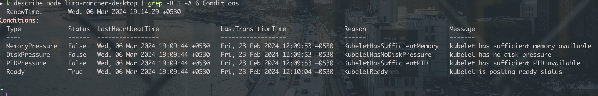

## Pods
```sh
# watch logs real time
k logs pod-name -f

# view logs of previous restarts
k logs pod-name --previous
```

check status of pods/service - depending upon whether the control plane components are deployed as pods or a service respectively
```sh 
service kubelet status

# logs from
journalctl -u kube-apiserver
```

----

## Node

```sh
k describe node lima-rancher-desktop | grep -B 1 -A 6 Conditions
```

- helps understand the reason why the node is failing
- the flags represent different resources like disk, memory etc
- check memory and disk space in the nodes using commands `top` and `df -h`
---

- check certificates and CA name

- if multiple cnis are configured, the first cni is chosen in lexicographic order.

---

DNS : 
- a deployment `coredns` and a service `kube-dns`
- config map `coredns`, service acc `coredns`
- cluster role(coredns, kube-dns) and cluster rolebindings (coredns, kube-dns)
- port 53
- check config map


---

To get endpoints to a service directly
```sh
k get ep <svc-name
```

---

set alias kn="kubectl -n nsname"
for easy access
```
kn get all
kn edit svc svcname
```

- check target port, node port, port
- check labels and selectors 
- check if the pod is managed by deployment or rs or ds etc

---

check logs and describe

for control plane static pods -check /etc/kubernetes/manifests


systemctl cat kubelet

<!-- restart dont just start - if config chnages -->
systemctl restart kubelet


---
```sh
k ... -o=jsonpath='{.item.spec[0].name}'

k ... -o=jsonpath='{.item[*].spec.name}'

k ... -o=jsonpath='{.item[*].spec.name}{.item[*].value}'

k ... -o=jsonpath='{.item[*].spec.name}{"\n"}{.item[*].value}'

```